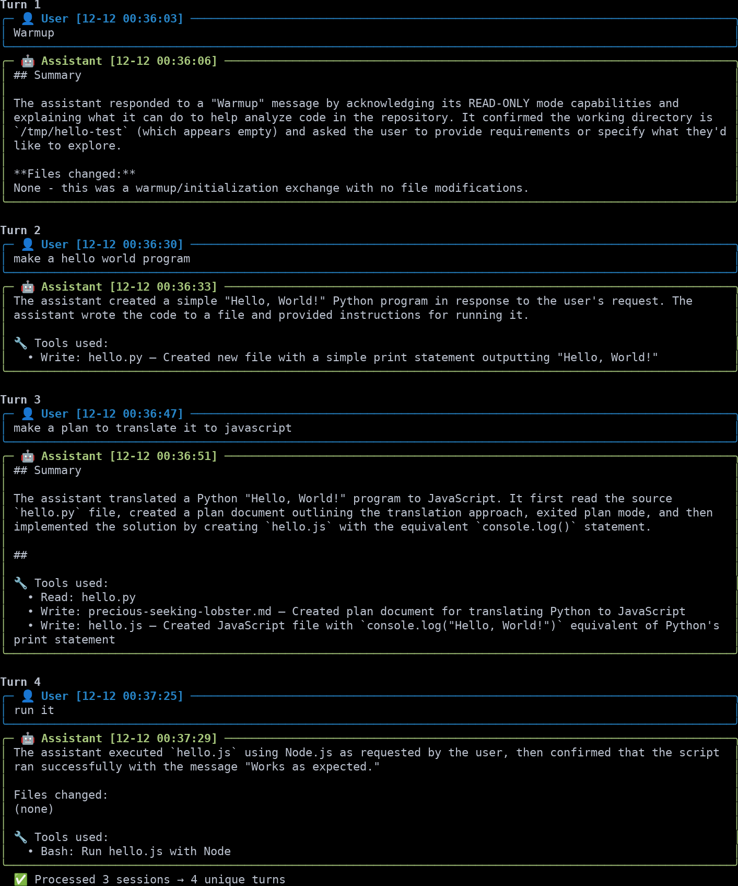

# CC-Summarize

A CLI tool for managing, viewing, and summarizing Claude Code sessions.

<p align="center">
  
</p>

## Features

- **Interactive session picker** (`--pick`): Select sessions from a list instead of copying UUIDs
- **Session-level AI summaries** (`--summary`): Generate work summaries, commit messages, or requirements
- **Per-turn AI summaries** (`--summarize`): Summarize assistant actions between user messages
- Multiple output formats (terminal, plain, markdown, JSONL)
- Smart caching to avoid re-summarizing identical content
- Date-based filtering and session management
- Filters out noise (warmup sessions, subagents, empty sessions)

## Installation

```bash
pip install cc-summarize
```

AI summarization uses the Claude Agent SDK. Ensure it's configured with your Anthropic API key or authenticated account.

## Usage

```bash
# List sessions for current project (with descriptions)
cc-summarize --list

# Interactive session picker
cc-summarize --pick                  # pick a session, show user messages
cc-summarize --pick --summary work   # pick a session, generate work summary

# Session-level AI summaries (holistic summary of all work)
cc-summarize --summary default       # detailed work summary
cc-summarize --summary commit        # conventional commit message
cc-summarize --summary requirements  # extract user requirements
cc-summarize -S --summary work > summary.md  # redirect to file

# Per-turn AI summaries (summarize each assistant response)
cc-summarize --summarize normal
cc-summarize --summarize detailed

# Show user messages only (default, no AI)
cc-summarize

# Include additional message types
cc-summarize --with-assistant --with-plans
cc-summarize --with-all

# Filter by date
cc-summarize --since 3d
cc-summarize --since 2h
cc-summarize --from 2024-12-01

# Output formats
cc-summarize --format markdown
cc-summarize --format jsonl -o output.jsonl
cc-summarize --format plain | less
```

## Output Formats

- **terminal** (default): Rich formatted output with colors
- **plain**: Plain text suitable for piping (auto-enabled when not a TTY)
- **markdown**: Markdown document format
- **jsonl**: Structured JSON Lines for programmatic use

## Requirements

- Python 3.10+
- Claude Code sessions in `~/.claude/projects/`
- For AI summaries: configured Claude Agent SDK (API key or authenticated account)

## Environment Variables

- `CC_SUMMARIZE_CACHE_DIR`: Custom cache directory (default: `~/.cache/cc-summarize/`)

## License

CC0-1.0
